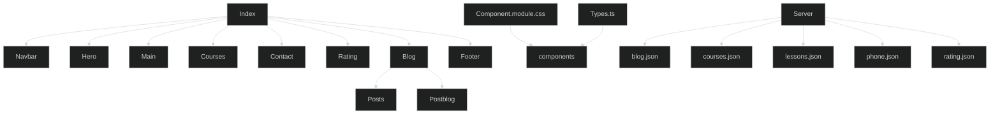

# Teste Coodesh FrontEnd - Junho 2023

Bem vindo!
Esta é a solução encontrada para o desafio de Frontend da empresa [Inbound](https://www.agenciainbound.com.br/) 

## 🌐 Acesso ao deploy no Vercel
[Deploy Unycos](https://inbound-psi.vercel.app/) 

## 📋 Demanda
- [x] Utilizar linguagens HTML5 e CSS3 com os efeitos e animações propostas versão Desktop e Responsiva Mobile.
- [x] Usar boas práticas de HTML para SEO.
- [x] Usar estratégias de CSS Module.
- [x] Não utilizar nenhum tipo de design system pré-pronto: Bootstrap, material design, etc.
- [x] Configurar o projeto para rodar em localhost:9004

## 🧩 Extras
- [x] Diferencial 1 - Construir um componente utilizando para o montar o slider central de forma dinânica consumindo uma RestAPI informada.
- [ ] Diferencial 2 - Escrever Unit Tests ou E2E Test. Escolher a melhor abordagem e biblioteca.
- [x] Diferencial 4 - Publique o projeto em alguma plataforma, como por exemplo a Vercel.

## ✍️ Desenvolvimento do Projeto

### Decisões de projeto
A proposta de desenvolvimento focou em 3 fatores principais, com foco na metodologia **DRY** `Don't Repeat Yourself`, **Clean Code** e **SOLID**.
- Consistência: buscou-se manter uma estrutura consistente em todo o código para facilitar a leitura e compreensão, com o uso de estilo de codificação consistente, incluindo a nomenclatura de variáveis, formatação, indentação e comentários.
- Clareza: a escrita do código foi realizada buscando-se a clareza e a legibilidade, evitando abreviações excessivas e utilizando nomes descritivos para funções, variáveis e classes. 
- Modularidade: o projeto se pautou pela divisão do mesmo em componente e funções menores e bem definidas, cada uma com uma responsabilidade específica, visando a manutenção, teste e reutilização do código.

### Organização do código
Na organização do código buscou-se seguer os seguintes princípios:
- Estrutura de diretórios: organização do código em uma estrutura de diretórios lógica e coerente, separando componentes distintos, como módulos, modelos, arquivos de configuração.
- Modularidade: divisão do código em arquivos e módulos separados, com base em sua funcionalidade ou propósito.
- Documentação: descritivo com uma documentação adequada para o projeto, descreve a finalidade do projeto, instruções para instalação, dependências, configuração e execução.

### Linha de Raciocínio
Para a realização do desafio estabeleci alguns parâmetros a seguir no desenvolvimento
- Inicialmente o projeto foi dividido em componentes individuais `/Navbar.tsx`, `/Hero.tsx`, `/Main.tsx`, `/Courses.tsx`, `/Contact.tsx`, `/Rating.tsx`, `/Blog.tsx`, `/Footer.tsx`, seguindo a lógica de que cada componente possa ser reutilizado em outros projetos. 
- Na seção  `/Main.tsx` foi construído um componente slider de forma dinâmica com a utilização da RestAPI disponibilizada.
- Todo o conteúdo em texto do projeto foi transferido para arquivos JSON específica dentro das pasta `/server`.
 
### Expansibilidade
Prevendo a possibilidade de extensão futura do site para novas linguagens (atingir novos mercados) já foi incluído um sistema de consumo de texto via `/texts.json` com a utilização de uma util `/textUtils.ts` com similaridade ao sistema `/i18n`. Desta forma, futuramente, ao se optar por um sistema de tradução do site para outras línguas, já teremos um consumível em JSON funcional, bastando adicionar as traduções desejadas.

### Organograma Estrutural


## ⚙️ Linguagens de Programação Utilizadas
[](https://www.linkedin.com/in/targanski/)

## 🖥️ Documentação de Implantação

### Pré-requisitos
Antes de prosseguir com a implantação, é necessário garantir que o ambiente de desenvolvimento atenda aos seguintes pré-requisitos:
Node.js (versão 12 ou superior) instalado no servidor de hospedagem
Gerenciador de pacotes npm (ou yarn) instalado

### Etapas de Implantação
Siga as etapas abaixo para implantar o código web:

1. Clone o repositório do código web para o servidor de hospedagem.
```bash
git clone https://github.com/Ftarganski/inbound.git
```

2. Navegue até o diretório raiz do projeto clonado.

3. Execute o seguinte comando para instalar as dependências do projeto:
```bash
yarn install
```

4. Após a conclusão da instalação das dependências, execute o seguinte comando para iniciar a aplicação:
```bash
yarn dev
```
Este comando irá iniciar a aplicação no modo de desenvolvimento.

5. Acesse a aplicação web no navegador utilizando o endereço local: 
[http://localhost:9004](http://localhost:9004)

## 📄 Configurações Adicionais

### Metadados
A página inicial `/index.tsx`contêm metadados importantes para SEO e exibição nos motores de busca. Certifique-se de atualizar as informações conforme necessário, incluindo o título, descrição, palavras-chave e favicon.

### Imagens e Logos
Certifique-se de substituir as imagens de exemplo pelos arquivos corretos da sua aplicação. As imagens estão localizadas na pasta `/public/images`. Certifique-se de manter a estrutura correta de pastas e atualize as referências de imagem nos componentes apropriados.

### Considerações Finais
Após a conclusão dessas etapas, o código web estará implantado e acessível por meio do servidor de hospedagem. Certifique-se de realizar os testes necessários para garantir que a aplicação esteja funcionando conforme o esperado.

Lembre-se de que esta documentação cobre apenas a implantação do código web. Outros aspectos, como implantação de banco de dados, configurações de servidor e escalabilidade, podem exigir etapas adicionais que não são abordadas aqui.
